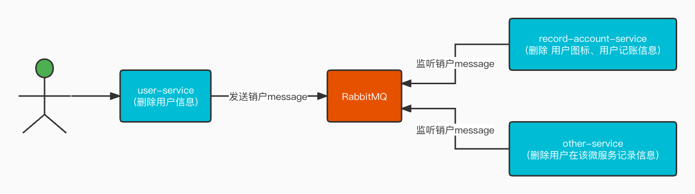
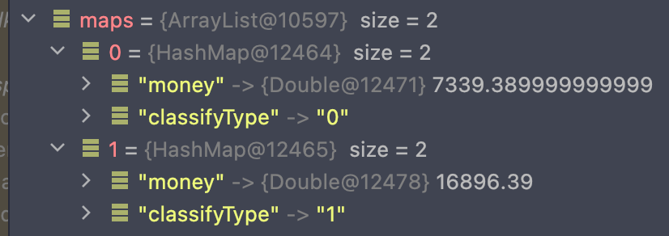
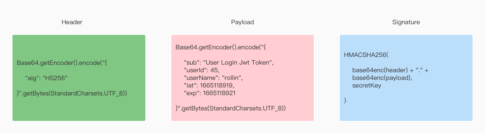
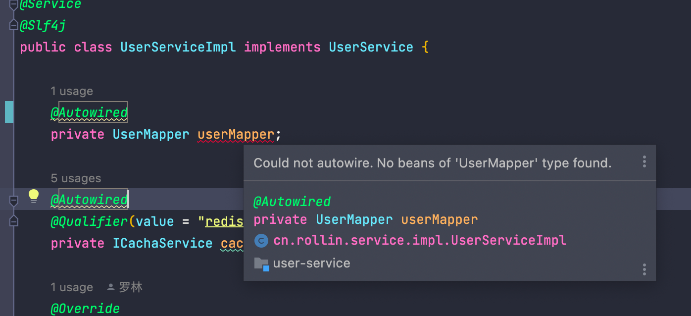
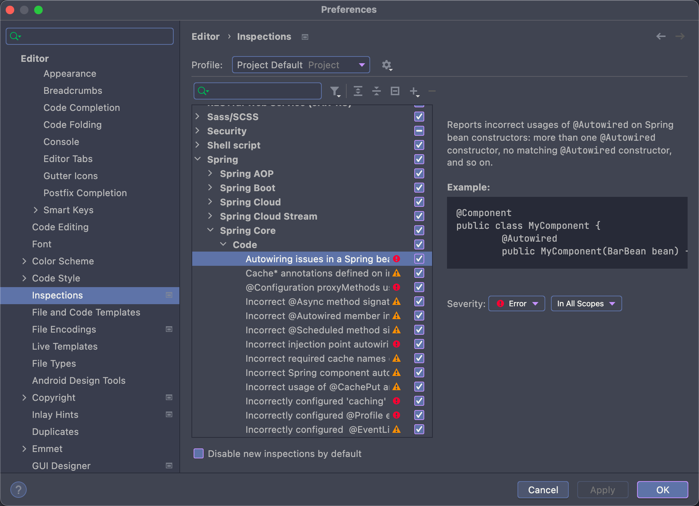

<div style="width: 100%; font-size: 3rem; text-align: center;"><span>记账助手</span></div>

```
创建时间：2022-09-30 07:41:39
描   述：本次的Api是对之前的研发进行重构
技 术 栈：SpringBoot、SpringCloudAlibaba(Nacos)、Mybatis Plus(自动生成代码且预置了一些增删改查)
```

# 项目架构

## 微服务模块介绍

### common 模块

common作为模块，不是微服务，其作用大致如下。

* 作为一般微服务的父pom，因此该pom依赖了一些常用的依赖库，例如springcloud、springboot、lombok等。
* 作为多个微服务共同使用的工具类、bean集合，例如 Response<T>、Response.buildXXXX、ResStatusEnum等。
* 一些框架工具也放在此模块中，比如鉴权的拦截工具类、自定义异常拦截等。

### gateway-service

本服务作为所有微服务的网关服务。

### user-service

用户微服务

### record-account-service

记账微服务


## 微服务之间关系


# 系统设计

## 销户系统设计

销户一般请求的是用户微服务，进行删除账户，由于其它的微服务会涉及到存储用户的信息，因此也需要同步删除其他微服务的用户信息；

实现的方式有两种：

* RPC 
* 消息队列 MQ

由于销户涉及的微服务比较多，使用RPC的方式明显薄弱，因此选择MQ是最佳的选择。

### 系统设计流程图




# 知识整理

## mybatis-plus 使用技巧

### 官网首页

https://www.baomidou.com/

### 条件构造器

https://www.baomidou.com/pages/10c804/

### 数据库分表查询

#### 题目

根据用户id查询当月下，收入和支出的账单金额。

#### 题目解析

1.使用group by 对收入和支出进行分组。

2.使用date_format方法指定请求年月。

3.使用聚合函数sum求值。

#### java代码

```java
DateTimeFormatter dtf = DateTimeFormatter.ofPattern("yyyyMM", Locale.CHINA);
String format = dtf.format(LocalDate.now());
QueryWrapper<RecordAccountDO> objectQueryWrapper = new QueryWrapper<>();
objectQueryWrapper.select("classify_type classifyType, SUM(bill_money) as money")
        .apply("date_format(record_time, '%Y%m') = {0}", format)
        .groupBy("classify_type");
List<Map<String, Object>> maps = recordAccountMapper.selectMaps(objectQueryWrapper);
```

#### 等价于sql代码

```sql
SELECT classify_type classifyType, SUM(bill_money) as money FROM t_record_account WHERE (date_format(record_time, '%Y%m') = ?) GROUP BY classify_type
```

#### 响应结果




### 联表查询的另一种体现

记账(t_record_account)表中有一个字段分类ID(classifyId)，分类表中（t_classify）表中有一个字段图标ID(icon_id)。

#### 实现目的

通过t_record_account查询出记账列表 --> 通过 classifyId 查询对应分类 --> 通过 icon_id 查询对应的图标对象 --> 将icon对象放入，t_record_account。

#### java代码

```java
private void handlerIcon(List<DayRecordAccountObject> dayRecordAccountObjects) {
    List<Long> classifyIds = dayRecordAccountObjects.stream()
            .map(DayRecordAccountObject::getClassifyId).collect(Collectors.toList());

    // 从分类列表中剥离iconId，然后通过iconId 查训icon对象
    List<ClassifyDO> classifyDOS = classifyMapper
            .selectList(new QueryWrapper<ClassifyDO>().in("classify_id", classifyIds));
    List<IconDO> iconDOS = iconMapper.selectList(new QueryWrapper<IconDO>()
            .in("icon_id", classifyDOS.stream().map(ClassifyDO::getIconId).collect(Collectors.toList())));

    // 剥离出 (classifyId, icon对象)
    List<Map<Long, Icon>> iconMaps = classifyDOS.stream().flatMap(classifyDO -> iconDOS.stream()
                    .filter(iconDO -> !ObjectUtils.notEqual(iconDO.getIconId(), classifyDO.getIconId()))
                    .map(iconDO -> {
                        // map存放 （classifyId, Icon对象）
                        Map<Long, Icon> map = new HashMap<>();
                        map.put(classifyDO.getClassifyId(), CommonUtil.copyProperties(iconDO, new Icon()));
                        return map;
                    }))
            .collect(Collectors.toList());

    // 把icon对象塞入 DayRecordAccountObject 对象中
    dayRecordAccountObjects.forEach(dayRecordAccountObject -> {
        Optional<Icon> iconOptional = iconMaps.stream()
                .filter(iconMap -> ObjectUtils.isNotEmpty(iconMap.get(dayRecordAccountObject.getClassifyId())))
                .map(iconMap -> iconMap.get(dayRecordAccountObject.getClassifyId())).findAny();
        dayRecordAccountObject.setIcon(iconOptional.orElse(null));
    });
}
```

#### 核心点

1.通过classifyId查询出来的icon对象，使用map对象将 key=classifyId，value=iconObject 进行存储。

2.通过dayRecordAccountObjects遍历出来的对象进行添加icon图标对象。


## JWT 相关

jwt(Json Web Token)：jwt用于web与后台交互进行校验的token。

### jwt 构成

jwt由三部分构成，分别为头部、载荷、签名构成。三部分中间使用 ”.“ 进行分隔。

```java
JWTString=Base64(Header).Base64(Payload).HMACSHA256(base64UrlEncode(header)+"."+base64UrlEncode(payload),secret)
```


### 代码示例

#### Java 代码

```java
String compact = Jwts.builder().setSubject("User Login Jwt Token")
     .claim("userId", 45)
     .claim("userName", "rollin")
     .setIssuedAt(new Date())
     .setExpiration(new Date(System.currentTimeMillis() + 2000))
     .signWith(SignatureAlgorithm.HS256, "recordaccount.jwt.key")
     .compact();
```


#### 运行结果

<span style="color: #11ee01;">eyJhbGciOiJIUzI1NiJ9</span>.<span style="color: #ab04e5;">eyJzdWIiOiJVc2VyIExvZ2luIEp3dCBUb2tlbiIsInVzZXJJZCI6NDUsInVzZXJOYW1lIjoicm9sbGluIiwiaWF0IjoxNjY1MTE4OTE5LCJleHAiOjE2NjUxMTg5MjF9</span>.<span style="color: #a1a1a1;">p8XdYXk3-tIudJP8kQTnoCuF90iLIshb-gpisKmlY5o</span>

### 示例剖析

构成示例



#### Header 部分

##### 源串

```
eyJhbGciOiJIUzI1NiJ9
```

##### decode 串

```json
{"alg":"HS256"}
```

#### 载荷部分

##### 源串

```
eyJzdWIiOiJVc2VyIExvZ2luIEp3dCBUb2tlbiIsInVzZXJJZCI6NDUsInVzZXJOYW1lIjoicm9sbGluIiwiaWF0IjoxNjY1MTE4OTE5LCJleHAiOjE2NjUxMTg5MjF9
```

##### decode 串

```json
{"sub":"User Login Jwt Token","userId":45,"userName":"rollin","iat":1665118919,"exp":1665118921}
```


### Signature 签名部分

```
p8XdYXk3-tIudJP8kQTnoCuF90iLIshb-gpisKmlY5o
```

签名算法

```java
HMACSHA256(
  base64UrlEncode(header) + "." + 
  base64UrlEncode(payload),
  secret
)
```


# 错误整理

## idea 注入mapper报错报红

### 报错示例



### 解决方案

#### 方案一 （推荐）

将 @Autowird 改为 @Resource 即可。

#### 方案二

为 @Autowired 注解设置required = false；他表达的意思是：使用 @Autowired 注解不再去校验userMapper是否存在了，也就不会有警告了

#### 方案三

把IDEA的警告关闭掉；不建议使用，因为Idea的灵魂就是提示，去掉了就没多大灵魂所在。



### 参考地址

https://blog.csdn.net/JFENG14/article/details/123281224


