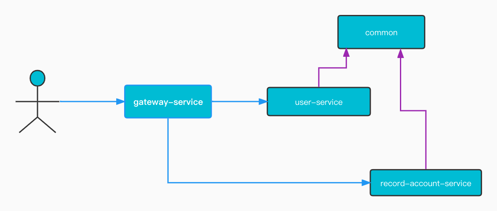

<div style="width: 100%; font-size: 3rem; text-align: center;"><span>记账助手</span></div>

```
创建时间：2022-09-30 07:41:39
描   述：本次的Api是对之前的研发进行重构
技 术 栈：SpringBoot + SpringCloudAlibaba(Nacos)
```

# 项目架构

## 微服务模块介绍

### gateway-service

本服务作为所有微服务的网关服务。

### user-service

用户微服务

### record-account-service

记账微服务


## 微服务中间关系




